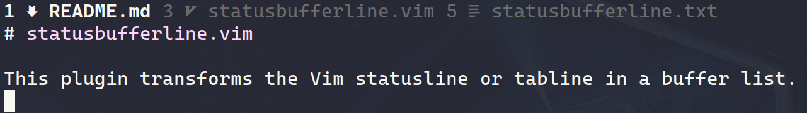

# statusbufferline.vim

This plugin transforms the Vim statusline or tabline in a buffer list.

# Usage

Simply install the plugin using your favorite package manager.

To configure it, these variables:

- `g:sbline_show_bfnr`: If 1 (default), the buffers are listed with their
  respective number. 0 to disable.  
- `g:sbline_show_modified`: if 1 (default), shows if a buffer is modified.  
- `g:sbline_ruler`: If 1, emulated the Vim ruler on the righ side of the
  statusline. If 2, shows a more minimal ruler than Vim's default. If
  3 (default), transforms the ruler in a tablist and if 0, don't show any ruler.  
- `g:sbline_to_status`: 1 or 0 (default). Draws the sbline on the statusline.  
- `g:sbline_to_tabs`: 1 (default) or 0. Draws the sbline on the tabline.  
- `g:sbline_crop_bufname`: 1 (default) or 0. Crops the buffername to be only the
  filename, without directories.  
- `g:sbline_ignore`: Vim list with filetypes and buftypes that should not me
  shown on the line. Includes "terminal", "quickfix" and "nofile" by default.  
- `g:sbline_dynamic_tabline`: If 1, adds an autocmd hook to show the tabline
  (`showtabline` 2) when the plugin lists more than one buffer and automatically
  hide it (`showtabline` 1) with less than two buffers listed. Disabled with
  0 (default).  
- `g:sbline_devicons`: If 1 (default) and a "vim-devicons"-compatible plugin is
  installed, the correspondent filetype icon for the buffer will be shown in the
  statusbufferline.  

The coloring of statusbufferline is set by the default statusline and tabline
coloring groups, but used only `TabLineSel` for setting the color of the
current buffer.
